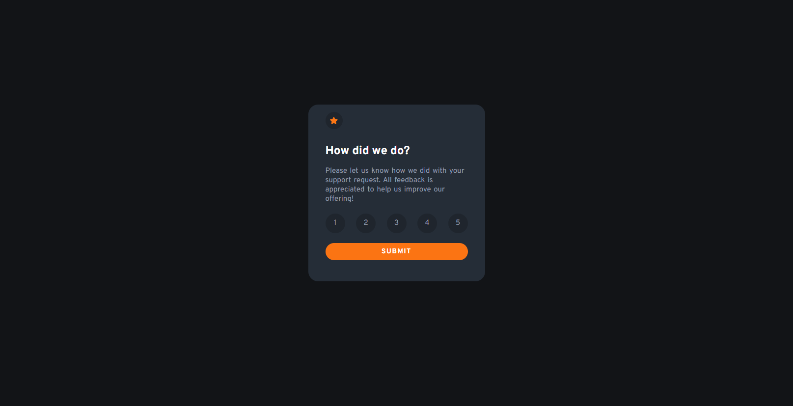
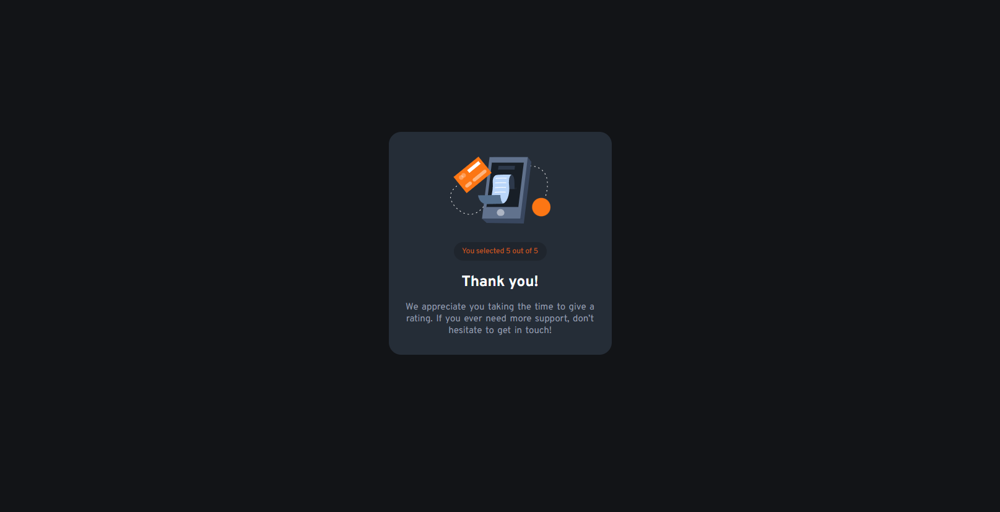

# Interactive Rating Component

## Overview

This Interactive Rating Component is an engaging tool designed to gather user feedback through a rating system. Built with HTML, CSS, and JavaScript, it provides a nice user experience by transitioning between a rating state and a thank-you state upon submission. It's ideal for capturing customer satisfaction scores, product ratings, or any form of feedback. The component features the Overpass font from Google Fonts, ensuring clean and modern typography.

## Features

- **Responsive Layout:** Ensures a great appearance and functionality across all devices.
- **Custom Typography:** Utilizes the 'Overpass' font for readability and style.
- **Interactive Rating Selection:** Users can select their rating from 1 to 5, allowing for a range of feedback.
- **Dynamic State Transition:** Leveraging JavaScript, the component transitions from the rating input state to a thank-you state after submission, enriching the user interaction.

## Screenshots





## Setup

To use this component in your project, follow these steps:

1. **Clone the Repository:**

```bash
git clone https://github.com/Wilmer856/interactive-rating-component.git
```

2. **Navigate to the Project Directory:**

```bash
cd interactive-rating-component-main
```

3. **Open the `index.html` file in a web browser to view the component.**

## Customization

- **Imagery:** Customize the star icons and thank-you illustration in the images directory to align with your visual branding.
- **Rating Scale:** The rating scale can be adjusted within the HTML to accommodate different levels of feedback, such as a scale of 1-10.
- **Styling:** Modify the styles.css to tailor the colors, fonts, and overall layout to match your site’s aesthetic.
- **JavaScript Interaction:** Enhance or alter the interactive elements by editing main.js, tailoring the component's behavior to your needs.

## Dependencies

- Google Fonts: [Overpass](https://fonts.google.com/specimen/Overpass) for typography.
